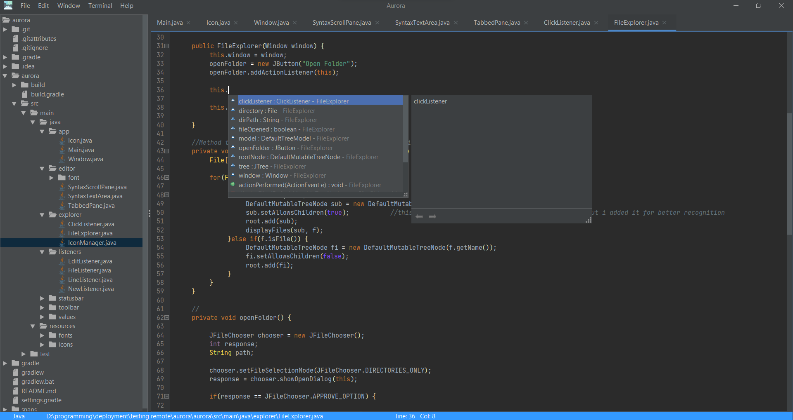
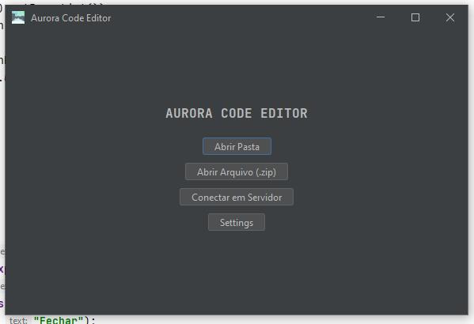
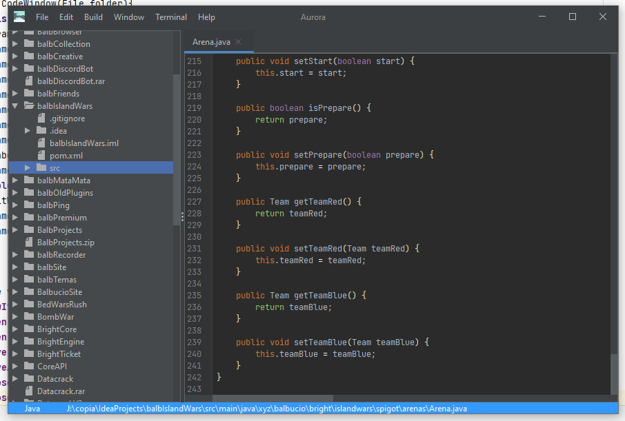

# Créditos
Esse projeto foi baseado no https://github.com/Dinesh882002/aurora

# Aurora Code Editor
O Aurora Code Editor é um editor de código simples feito em Java. Pretendo com tempo ir deixando ele mais bonito, usual e útil. É importante resaltar que ele não se compara de nenhuma forma com um IDE ou Editor de Código grande, MUITAS funções dele NÃO ESTÃO COMPLETAS ou sofrerão ajustes no futuro.
<br><br>
Aurora Code Editor is a simple code editor made in Java. I intend to make it more beautiful, usual and useful over time. It is important to note that it is in no way comparable to a large IDE or Code Editor, MANY functions of it ARE NOT COMPLETE or will undergo adjustments in the future.

## Future Updates
In the future I intend to add the following functions to it:
- Managed Versioning
- Tree organization of files
- Project Configuration
- Editing Projects in ZIP File
- Java decompiler
- Java compiler
- Editing projects together or in server mode
- Update on this Logo (sorry, but I thought it was a bit silly)
- Managed Backup

# How to run
```
gradlew run
```
>**Note:** Have the java path environment variable set.

# Screenshots



